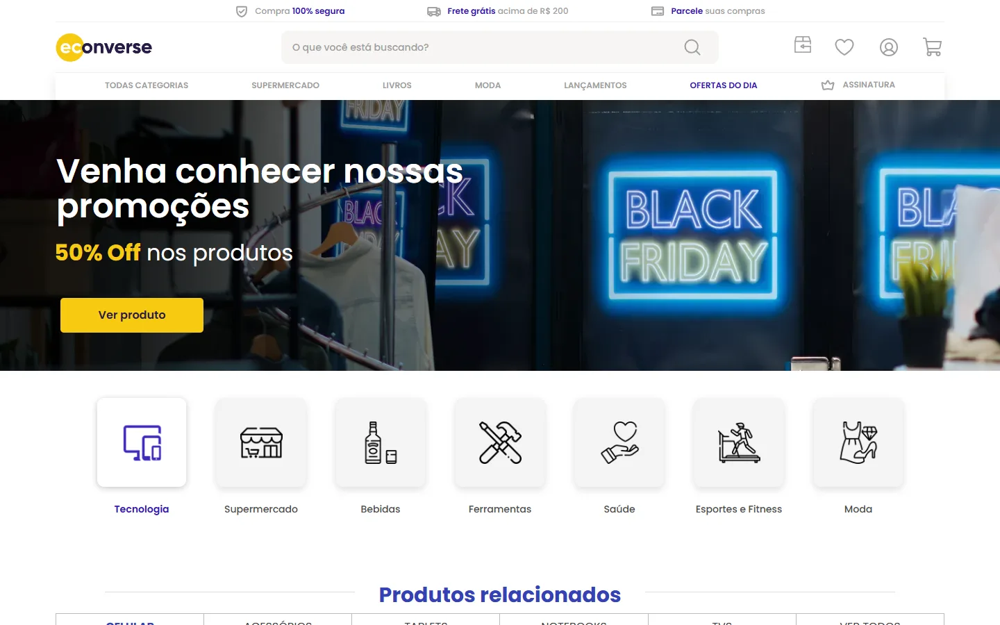
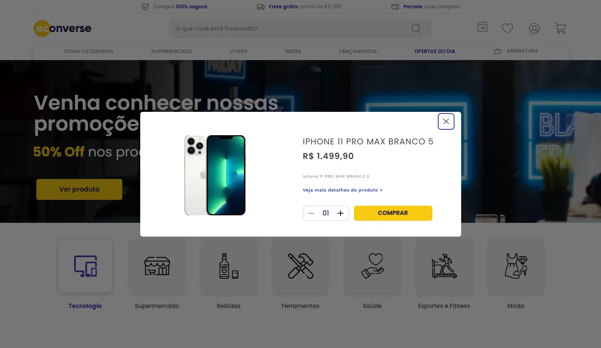

# Econverse: Home de e-commerce

Implementação da Home da loja **econverse** em **React 18 + TypeScript (strict) + Sass (CSS Modules)**, fiel ao layout do Figma (frame de 1440px), sem bibliotecas de UI, de carrossel ou de modal.



| Modal do produto                  | Mobile (375px)                      |
| --------------------------------- | ----------------------------------- |
|  |  |

> **Deploy:** ainda não publicado. O projeto já está pronto para a Vercel (`vercel.json`) e para o Netlify (`public/_redirects`); veja [Deploy](#deploy).

## Como rodar

Requisito: [Node.js](https://nodejs.org) 20+ (versão LTS).

Escolha uma das formas abaixo. Nas três, o navegador abre sozinho em `http://localhost:5173` (ou na próxima porta livre). Para encerrar, feche a janela ou o terminal, ou aperte `Ctrl + C`.

**1. Duplo clique (Windows):** abra o arquivo **`iniciar.bat`** na pasta do projeto. Na primeira vez ele instala as dependências, depois sobe o servidor.

**2. VS Code:** aperte `Ctrl + Shift + B` (ou use o menu **Terminal → Run Build Task…**) e escolha a tarefa **Iniciar projeto**.

**3. Terminal:**

```bash
npm install
npm run dev
```

> No **PowerShell**, se aparecer _"running scripts is disabled on this system"_, use `npm.cmd install` e `npm.cmd run dev`. Outra opção é liberar scripts para o seu usuário uma vez com `Set-ExecutionPolicy -Scope CurrentUser RemoteSigned`. O `iniciar.bat` e a tarefa do VS Code já evitam esse problema.

| Script            | O que faz                                         |
| ----------------- | ------------------------------------------------- |
| `npm run dev`     | Servidor de desenvolvimento (com proxy do JSON)   |
| `npm start`       | Mesmo que `npm run dev`                           |
| `npm run build`   | Checagem de tipos (`tsc -b`) + build de produção  |
| `npm run preview` | Serve o build localmente (também com o proxy)     |
| `npm run lint`    | ESLint (TypeScript strict, react-hooks, jsx-a11y) |
| `npm run format`  | Prettier                                          |
| `npm test`        | Vitest + Testing Library                          |

### Variáveis de ambiente (`.env`)

| Variável                | Padrão                               | Uso                                                  |
| ----------------------- | ------------------------------------ | ---------------------------------------------------- |
| `VITE_PRODUCTS_URL`     | `/api/products`                      | Endpoint que o front consome                         |
| `VITE_SITE_URL`         | `https://econverse-front.vercel.app` | URL pública usada em canonical, Open Graph e JSON-LD |
| `PRODUCTS_UPSTREAM_URL` | URL do JSON da Econverse             | (opcional) origem do proxy do Vite em dev/preview    |

O `.env` não tem segredos e está versionado. Sobrescreva valores em `.env.local`.

## Estrutura

```
src/
  assets/{icons,images}/   SVGs e imagens exportados do Figma (WebP)
  components/
    layout/Header/         Header + TopBar, SearchBar, HeaderActions, MainNav
    layout/Footer/
    HeroBanner/
    CategoryList/          CategoryList + CategoryCard
    ProductShelf/          ProductShelf + ShelfTabs, Carousel, ProductCard, ProductCardSkeleton
    PartnerBanners/        PartnerBanners + PartnerCard
    BrandList/
    Newsletter/            Newsletter + validation.ts
    ProductModal/          ProductModal + QuantitySelector
    ui/                    Button, SectionTitle, Modal, Logo, VisuallyHidden
  data/                    menu, topBar, headerActions, categories, shelfTabs, partners, brands, footerLinks
  hooks/                   useProducts, useCarousel, useFocusTrap, useLockBodyScroll
  services/products.ts     fetch + validação + adapter (API → domínio)
  types/                   product.ts, ui.ts
  utils/                   formatCurrency, formatQuantity, slugify, cx
  styles/                  _variables (tokens), _mixins, _reset, _typography, global.scss
  pages/Home/              monta as seções + JSON-LD dos produtos
```

- Um componente por pasta (`Componente.tsx`, `Componente.module.scss`, `index.ts`).
- Todo conteúdo estático repetido vem de `src/data` e é renderizado com `map`.
- Os módulos SCSS importam tokens e mixins com `@use '@/styles' as *;`.

## Decisões

### Fidelidade ao Figma

- Os valores vieram do **Figma (Dev Mode, via MCP)**, não das prints: cores, fontes, tamanhos, espaçamentos, raios e sombras estão em `src/styles/_variables.scss`.
- Alguns valores do Figma são diferentes dos estimados no enunciado:
  - Há **dois azuis**: `#3442b5` (títulos, abas, COMPRAR do card) e `#3019b2` (destaques da top bar, OFERTAS DO DIA, categoria ativa).
  - O amarelo é `#f7ca11` e o roxo escuro é `#271c47`.
  - O overlay do modal é `rgba(0,0,0,.54)`.
  - Fontes: **Poppins** como base, **Outfit 600** no título da newsletter e **Work Sans** nos links do rodapé e no texto/link do modal.
- O Figma tem **duas faixas de Parceiros** (uma depois da vitrine 1 e outra depois da vitrine 2) e uma **faixa branca no fim do rodapé**. As duas foram implementadas; as faixas reaproveitam `PartnerBanners`/`PartnerCard`.
- A conferência foi feita com screenshots headless (Chrome) comparados ao render do Figma e medindo as caixas dos elementos: todas as seções ficam a **até ~1,5px** das coordenadas do Figma (página com 4661px de altura contra 4660px).
- O hero e os banners de parceiros foram recortados exatamente na área visível do Figma e exportados em WebP (1x e 2x).
- Os ícones de categoria são silhuetas com alpha usadas como `mask-image`. Assim a cor (preto ou violeta) vem do CSS e qualquer categoria pode ficar ativa.

### Dados (`services/products.ts`)

- **CORS:** o servidor do JSON não envia `Access-Control-Allow-Origin`. O front chama `/api/products`, que é reescrito para a URL real:
  - em dev/preview, por `server.proxy` / `preview.proxy` no `vite.config.ts`;
  - em produção, pelo rewrite em `vercel.json` ou `public/_redirects`.
- **Preço em centavos:** é formatado com `Intl.NumberFormat('pt-BR', { currency: 'BRL' })` sobre `price / 100` (`utils/formatCurrency.ts`, com testes).
- **Adapter:** o JSON não tem id, preço antigo, parcelas nem frete. O adapter cria:
  - `id` = slug do nome + índice (estável);
  - `installment` = 2x de `price / 2` (arredondado para cima), sem juros;
  - `listPrice` (preço riscado) = **mock visual**: `price × 1.1` (`LIST_PRICE_MARKUP`);
  - `freeShipping: true`, também mock visual, porque o layout mostra "Frete grátis" em todos os cards.
- **Uma única requisição:** `useProducts` roda na Home e repassa o estado para as 3 vitrines. Usa `AbortController` no unmount, valida `success` e descarta itens fora do formato.
- **Estados:**
  - _loading_: skeleton com as mesmas dimensões do card, sem CLS;
  - _erro_: mensagem e botão "Tentar novamente";
  - _lista vazia_: mensagem.
- As abas da vitrine 1 só trocam o estado ativo, porque o JSON não tem categoria.

### Por que não usar bibliotecas

O enunciado proíbe libs de UI, carrossel e modal. Cada uma foi substituída por pouco código:

- **Carrossel** (`useCarousel`): scroll nativo com `scroll-snap`, que já dá swipe no touch.
  - As setas rolam uma página de cards inteiros e ficam desabilitadas no início e no fim.
  - O estado é recalculado no scroll e com `ResizeObserver`.
  - Respeita `prefers-reduced-motion`.
  - A sombra dos cards fica visível graças a uma folga com margem negativa e máscara nas bordas.
- **Modal genérico** (`ui/Modal`): `createPortal` no `body`, Esc, clique no overlay, foco preso e devolvido a quem abriu (`useFocusTrap`) e scroll do body travado (`useLockBodyScroll`). O `ProductModal` é montado sobre ele e a quantidade volta a "01" a cada abertura.
  - O foco inicial vai para a própria caixa do diálogo: o leitor de tela anuncia o pop-up e o primeiro Tab leva ao X.
- **Ícones:** SVGs exportados do Figma, usados como `` com `alt=""` dentro de botões e links que têm `aria-label`.

### SEO e acessibilidade

- `lang="pt-BR"`, title, description, canonical, Open Graph/Twitter Card, theme-color, favicon SVG, `robots.txt` e `sitemap.xml`.
- JSON-LD `Organization` (no `index.html`) e `ItemList` de `Product` com `offers` em BRL (gerado quando os produtos carregam).
- Estrutura semântica:
  - `header`, `nav`, `main`, `section[aria-labelledby]`, `article` nos cards e `footer`;
  - um único `h1` (título do hero), `h2` por seção e `h3` nos produtos e parceiros.
- Imagens:
  - o hero (LCP) tem `preload` com `imagesrcset`, `fetchpriority="high"` e dimensões explícitas;
  - o restante usa `loading="lazy"`.
- As fontes do Google carregam de forma assíncrona (preload + `onload`, com `noscript`), com `preconnect` e `display=swap`.
- Acessibilidade:
  - skip link e `:focus-visible` em todos os controles;
  - abas com `tablist`/`tab`/`aria-selected` e navegação por setas;
  - categorias com `aria-pressed`;
  - newsletter com `aria-invalid`, `aria-describedby` e mensagens em `aria-live`;
  - no card, o botão do nome cobre foto e nome (sem aninhar elementos interativos).

**Lighthouse** (build de produção via `vite preview`):

| Perfil  | Performance | Acessibilidade | Boas práticas | SEO |
| ------- | ----------- | -------------- | ------------- | --- |
| Desktop | 100         | 97             | 100           | 100 |
| Mobile  | 98          | 97             | 100           | 100 |

### Responsividade

O desktop (1440px) é a referência. Abaixo dele:

- o carrossel mostra 3, 2 e depois 1 card;
- categorias, marcas, menu, top bar e abas ganham scroll horizontal;
- a busca vai para baixo do logo;
- newsletter, banners e rodapé empilham.

## Testes

`npm test` roda 27 testes:

- `formatCurrency` e `formatQuantity`;
- adapter e `fetchProducts` (sucesso, `success: false`, HTTP 500, itens inválidos);
- `useProducts` (loading → success, erro → retry, abort no unmount);
- `ProductModal`:
  - portal, `aria-modal` e nome acessível;
  - foco inicial, foco preso com Tab/Shift+Tab e foco devolvido;
  - fechar com Esc, X e overlay;
  - quantidade com mínimo 1, dois dígitos e reinício;
- `Newsletter`: validação, foco no primeiro erro e envio simulado;
- `Home`: o modal abre pelo COMPRAR dos cards.

## Deploy

- **Vercel:** importe o repositório. O `vercel.json` já tem o rewrite de `/api/products` e cache longo para `/assets`.
- **Netlify:** build `npm run build` e publish `dist`. O `public/_redirects` faz o proxy do JSON.
- Ajuste `VITE_SITE_URL` (e as URLs de `public/robots.txt` e `public/sitemap.xml`) para o domínio final.

## O que ficou fora ou diferente do layout

- **Contraste:** o cinza `#9f9f9f` (top bar e menu) e o `#808080` (preço riscado) são do Figma e ficam abaixo de 4.5:1. Mantive as cores do layout; é o único ponto que o Lighthouse aponta em acessibilidade (97).
- **Fonte dos links do rodapé:** no Figma, as colunas Institucional e Ajuda usam Work Sans e a coluna Termos usa Poppins. Padronizei Work Sans nas três por parecer inconsistência do arquivo.
- **Textos dos cards e do modal:** o layout usa lorem ipsum; a implementação mostra o nome, a descrição e o preço reais da API. Por isso os cards têm 1 linha de nome (o espaço de 2 linhas continua reservado).
- **Parcelas e preço riscado:** o layout mostra valores fixos ("R$ 30,90", "2x de R$ 49,95"). Aqui eles são calculados a partir do preço real (ver Adapter).
- **Foto do produto:** vem da API (247×228). No card ela é centralizada em `contain`; no modal, `cover` reproduz o recorte 247×192 do Figma.
- **Links** (menu, rodapé, marcas, "Ver todos", CONFIRA) apontam para âncoras (`#...`), porque só existe a Home. As exceções são os ícones sociais do rodapé, que abrem os perfis reais da Econverse (Instagram, Facebook e LinkedIn) em nova aba. COMPRAR do modal apenas fecha o modal (não há carrinho).
- **Deploy:** não publicado (ver acima).
